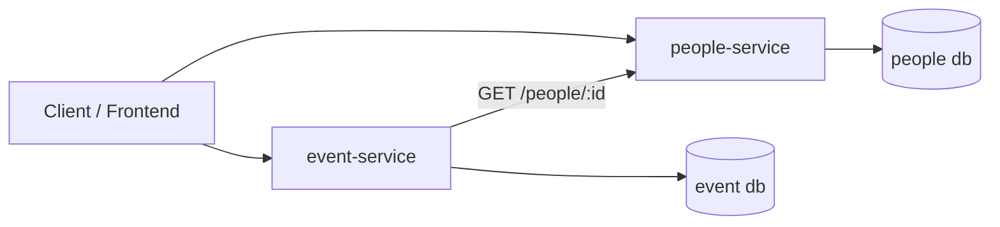
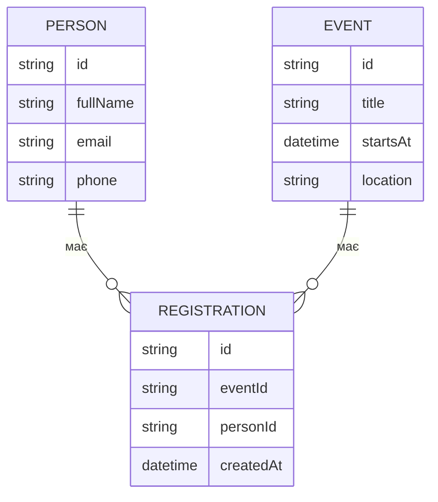

# EventPass

## Лабораторний курс: Розробка ПЗ на платформі Node.js

**EventPass** — навчальний сервіс для реєстрації учасників на події, реалізований як **2 мікросервіси × 3 основні роути**, з тестами, CI/CD та діаграмами.

> Примітка: технічні ендпоїнти типу `/health` можуть існувати для перевірки працездатності, але **не входять** у вимогу “3 роути на сервіс”.

---

## Лабораторна робота №0 — Вибір ідеї

### Ідея

- **People Service** управляє учасниками (контакти, профіль).
- **Event Service** управляє подіями та реєстраціями на них.

### Команда / Виконавець

- Виконавець: **Mojo** (індивідуально)

### Репозиторій

- GitHub repo: https://github.com/<YOUR_LOGIN>/eventpass

---

## Лабораторна робота №2 — Документація структури

- Архітектура (діаграма компонентів): `docs/architecture.md`
- Модель даних (ER): `docs/data-model.md`
- Ключові сценарії та оновлення даних: `docs/scenarios.md`

---

## Архітектура

### Сервіси та роути (2×3)

**1) people-service**

- `POST /people` — створити учасника
- `GET /people/:id` — отримати дані учасника
- `PATCH /people/:id` — оновити контактні дані

**2) event-service**

- `POST /events` — створити подію
- `POST /events/:id/register` — зареєструвати учасника (personId)
- `GET /events/:id/registrations` — список реєстрацій на подію

### Компонентна взаємодія

---

## Модель даних (чернетка)

---

## Основні сценарії

1. **Створити подію**: `POST /events`
2. **Додати учасника**: `POST /people`
3. **Реєстрація**: `POST /events/:id/register` → event-service перевіряє `personId` через people-service → створює REGISTRATION
4. **Список учасників події**: `GET /events/:id/registrations`

---

## План виконання лабораторних

- [x] **ЛР0** Вибір ідеї, репозиторій, README
- [x] **ЛР1 (08.10.2025)** Пакети, prettier, eslint, hooks
- [x] **ЛР2 (22.10.2025)** Діаграми, ER, сценарії оновлення даних
- [ ] **ЛР3 (05.11.2025)** Прототип (статичні дані)
- [ ] **ЛР4 (19.11.2025)** БД + інтеграція
- [ ] **ЛР5 (03.12.2025)** Unit + інтеграц. + E2E + mutation репорт
- [ ] **ЛР6 (17.12.2025)** CI/CD, staging, доступ з інтернету
