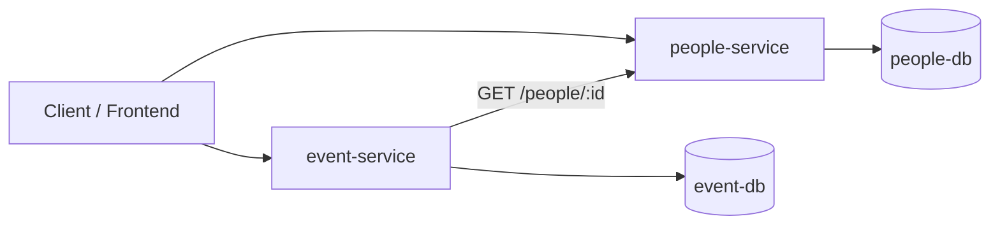

# Лабораторна робота №2 — Архітектура застосунку

## Компоненти системи

Система **EventPass** складається з двох мікросервісів:

- **people-service** — керує сутністю `Person` (контактні дані учасника)
- **event-service** — керує сутностями `Event` та `Registration` (події та реєстрації)

Кожен сервіс має власне сховище даних (окрема база) та незалежний життєвий цикл деплою.

## Взаємодія компонентів

`event-service` виконує перевірку існування `personId` через HTTP-запит до `people-service`.

## Межі відповідальності

- **people-service**
  - створення та редагування учасників
  - повертає дані конкретного учасника
- **event-service**
  - створення подій
  - реєстрація учасників на події
  - повертає список реєстрацій на подію

## Обмін даними між сервісами

- `event-service` зберігає в `Registration` лише `personId`.
- Для отримання деталізованої інформації про учасника (ім'я/контакти) можливе:
  1. **збагачення** відповіді через виклики `people-service` (N+1 запит; придатно для прототипу),
  2. або оптимізація в майбутньому (batch endpoint / кешування / денормалізація).
