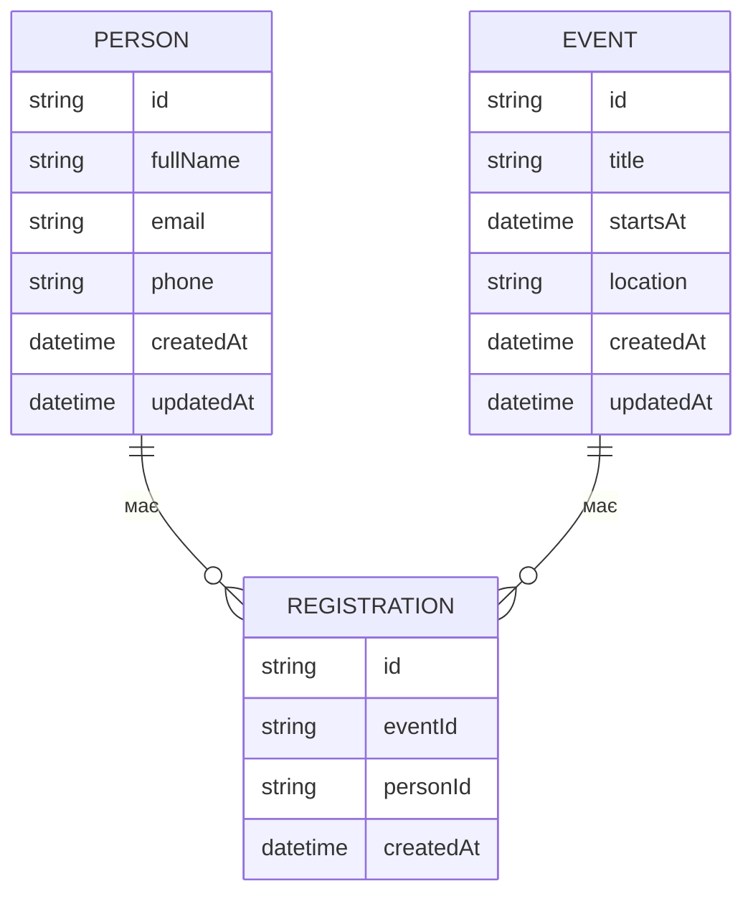

# Лабораторна робота №2 — Модель даних (ER)

## Сутності

- `PERSON` (people-service)
- `EVENT` (event-service)
- `REGISTRATION` (event-service)

## ER-діаграма

## Обмеження та індекси (рекомендовано)

### people-service / PERSON

- `email` — унікальний (optional, якщо потрібно)
- валідація формату email/phone на рівні сервісу

### event-service / EVENT

- `startsAt` має бути валідною датою/часом (ISO)
- `title` не порожній

### event-service / REGISTRATION

- унікальність пари (`eventId`, `personId`) — щоб не було дубль-реєстрації одного учасника на одну подію
- `createdAt` — час створення реєстрації
